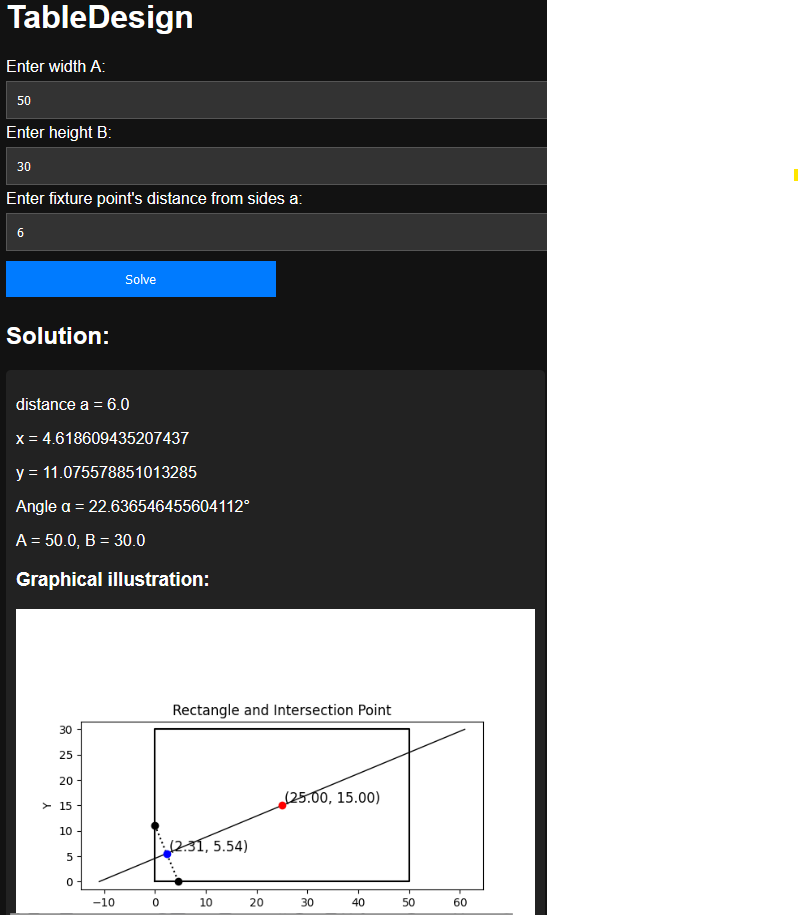

# Equation Solver Web App

## Description
A Flask web application that solves equations and visualizes the results.

## Why Use a Virtual Environment?
Using a virtual environment is important because it allows you to create an isolated space for your project. This means that the dependencies for your project won't interfere with other projects or the global Python environment. It helps avoid version conflicts and makes your project easier to manage and deploy.

## Cloning repository and setting up virtual environment
```bash
cd {into your directory where you want to make the clone directory}
git clone https://github.com/pontta/TableDesign.git
cd TableDesing
python -m venv venv
```
On Windows
```bash
venv\Scripts\activate
```
On Linux
```bash
source venv/bin/activate
```

## Requirements
Make sure you have Python installed. Then, install the required packages:

```bash
pip install -r requirements.txt
```

## Run application
To run the application, use
```bash
python app.py
```
Then open your browser and go to http://127.0.0.1:5000/.

## Usage
You can feed the measures of the table in A and B directions and click 'Solve' button.
